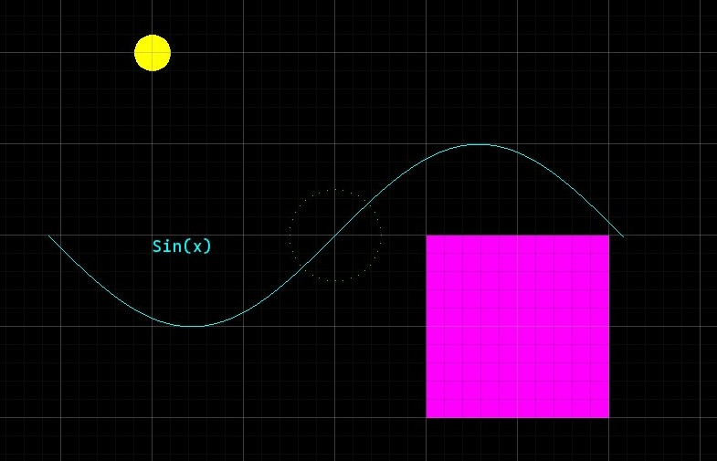

# SharpBox Graphics Framework

**SharpBox** is a lightweight 2D graphics framework built on [SFML](https://www.sfml-dev.org/). It provides an intuitive interface for drawing points, shapes, lines, grids, and text, making it ideal for educational projects, prototypes, and graphical visualizations.




## Features
- **Flexible Primitives**: Easily add points, lines, rectangles, circles, and grids.
- **Text Rendering**: Display custom text with any TrueType font.
- **Grid Overlay**: Visualize your space with minor and major grid lines.
- **Simple API**: Minimal setup required to start rendering.

## Getting Started

### Installation
1. Clone the repository:
   ```cmd
   git clone https://github.com/CodeHaks/SharpBox.git
   ```

2. Add the SFML.Graphics NuGet package to your project. If you don't have SFML installed, follow the installation guide for your platform.

### Usage
Create a Plane and Add Elements
```csharp

using SharpBox.Core;
using SFML.Graphics;
using SFML.System;

var plane = new Plane(800, 600, "SharpBox Demo");

// Add a grid for reference
plane.AddGrid(20, 100, new Color(50, 50, 50), new Color(150, 150, 150));

// Add some shapes and lines
plane.AddPoint(0, 0, Color.Red);
plane.AddCircle(100, 100, 50, Color.Green);
plane.AddRectangle(200, 200, 150, 100, Color.Blue);
plane.AddLine(new Position(0, 0), new Position(300, 300), Color.Yellow);

// Add text
string fontPath = "arial.ttf"; // Path to the .ttf font file
plane.AddText("Hello, SFML!", new Position(0, 0), 24, Color.White, fontPath);

// Start rendering
plane.Run();

```

### Project Structure
- SharpBox.Core: Core logic for managing the window, drawing shapes, and rendering.
- Position.cs: Helper class for converting coordinate positions to SFML's 2D vector.
- Plane.cs: Main class for managing and drawing graphical elements.
- README.md: Documentation for the project.

### License
This project is licensed under the MIT License.

